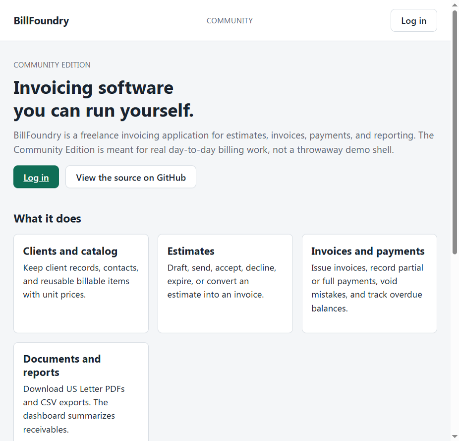
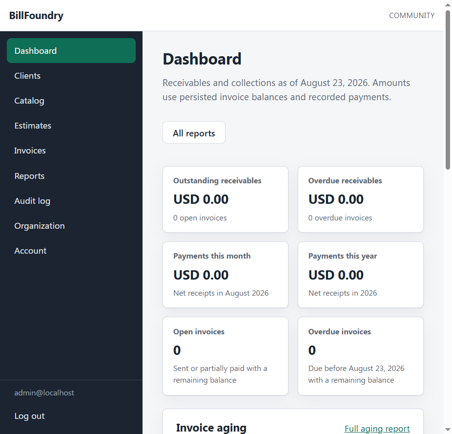

# BillFoundry

BillFoundry is a self-hosted invoicing application for freelancers. The Community Edition is a complete billing tool: clients, a service
catalog, estimates, invoices, payments, PDFs, and reports.

Copyright (C) 2026 Warren Galyen



## Why it exists

Most invoicing products are either a spreadsheet or a hosted SaaS account.
BillFoundry is software you run yourself. It keeps client and financial records
in SQL Server, signs people in with ASP.NET Core Identity, and generates
documents from data the application already stored.

The Community Edition is licensed under AGPLv3. A separate commercial license
may be offered later for a Pro edition. That possibility does not change the
AGPLv3 terms that apply to this code.

## Features

- Organization profile, logo, currency, and document prefixes
- Clients and contacts, with deactivation instead of hard deletes
- Service catalog with hourly, daily, item, and flat-fee units
- Estimates through draft, sent, accepted, declined, expired, and converted
- Invoices through draft, sent, partial, paid, overdue, and void
- Payments and reversals, without overpayment
- US Letter PDF invoices and estimates
- Dashboard and CSV reporting
- Append-only audit log for administrators
- Public demo mode with fictional data and locked credentials



## Technology

- .NET 10 / C# 14
- ASP.NET Core Blazor Web App (Interactive Server where the UI needs it)
- Entity Framework Core 10 and SQL Server
- ASP.NET Core Identity
- Sass (Dart Sass via EmbeddedSass.Net) for the UI
- PDFsharp for documents, PdfPig in tests
- xUnit

## Architecture

BillFoundry is a modular monolith.

| Project | Responsibility |
| --- | --- |
| `BillFoundry.Domain` | Entities, value objects, and invariants |
| `BillFoundry.Application` | Use cases, authorization policies, options |
| `BillFoundry.Infrastructure` | EF Core, Identity, PDF, seeding, file storage |
| `BillFoundry.Web` | Blazor UI and composition root |

There is one process and one database. Community Edition has a single
organization per installation. Self-hosted installs use SQL Server. The live
public demo uses PostgreSQL on Render because that is the managed database
Render provides. Application code uses `TimeProvider` instead of
`DateTime.Now`. Privileged work is authorized in application services, not
only by hiding links.

See [docs/architecture.md](docs/architecture.md) and
[docs/domain-model.md](docs/domain-model.md).

## Requirements

- .NET 10 SDK matching `global.json`
- SQL Server LocalDB, SQL Server, or the Compose SQL Server service

`GET /health` does not need a database. Sign-in and the rest of the app do.
`GET /health/ready` checks the configured database.

## Run locally

```bash
dotnet restore
dotnet build
dotnet test
dotnet run --project src/BillFoundry.Web
```

HTTPS development listens on `https://localhost:7270`. Open `/` for the public
landing page, then log in.

Development Identity seed (Development environment only):

| Role | Email | Password |
| --- | --- | --- |
| Administrator | `admin@localhost` | `Dev-Admin-Passw0rd!` |
| User | `user@localhost` | `Dev-User-Passw0rd!` |

Those passwords are local placeholders. Override them with user secrets if you
prefer not to use the committed Development values.

```bash
dotnet user-secrets set "ConnectionStrings:BillFoundry" "YOUR_CONNECTION_STRING" --project src/BillFoundry.Web
```

The equivalent environment variable is `ConnectionStrings__BillFoundry`.
Non-secret defaults live in `src/BillFoundry.Web/appsettings.json`. LocalDB is
configured in `appsettings.Development.json`.

Apply schema with:

```bash
dotnet ef database update --project src/BillFoundry.Infrastructure --startup-project src/BillFoundry.Web
```

Or set `Database:ApplyMigrationsOnStartup` to `true`. That option never drops
the database.

## Docker

Development stack:

```bash
docker compose up --build
```

Then open `http://localhost:8080`. Compose uses placeholder SQL credentials
(`DevOnly_P@ssw0rd` unless you set `MSSQL_SA_PASSWORD` in a gitignored `.env`).
Copy `.env.example` to `.env` to override them. Do not use those values in
production.

Public demo overlay:

```bash
docker compose -f compose.yaml -f compose.demo.yaml up --build
```

That overlay runs Production, enables Demo Mode, seeds fictional North Beacon
Studio data, and restores demo passwords on startup when
`DemoSeed__ResetOnStartup=true`.

Production image, from the repository root:

```bash
docker build -f src/BillFoundry.Web/Dockerfile -t billfoundry-web .
```

The image listens on HTTP 8080, runs as a non-root user, and does not apply
migrations unless you set `Database__ApplyMigrationsOnStartup=true`. Put TLS on
a reverse proxy. See [docs/deployment.md](docs/deployment.md).

The same image can use SQL Server or PostgreSQL through `Database__Provider`.
The public Render demo sets `PostgreSql`. Self-hosted Community installs keep
the SQL Server default.

Public demo on Render: connect this repo as a Blueprint (`render.yaml`). That
stack is the Docker web image plus Render Postgres, with Demo Mode and
fictional seed data. It is not a production business host. Locally:

```bash
docker compose -f compose.yaml -f compose.demo.postgres.yaml up --build
```

That overlay replaces SQL Server with Postgres (`http://localhost:8083`).

## Configuration

| Setting | Default | Purpose |
| --- | --- | --- |
| `ConnectionStrings:BillFoundry` | empty | SQL Server (default) or PostgreSQL when `Database:Provider` is `PostgreSql`. Required outside Development. |
| `Database:Provider` | `SqlServer` | `PostgreSql` only for the hosted public demo. |
| `Database:ApplyMigrationsOnStartup` | `false` | Apply pending migrations at start. Never drops the database. |
| `IdentitySeed:Enabled` | `false` | Development-only local accounts. Ignored in Production. |
| `DemoMode:Enabled` | `false` | Public demo restrictions. |
| `DemoSeed:Enabled` | `false` | Fictional demo dataset. Off unless you opt in. |
| `DemoSeed:ResetOnStartup` | `false` | Replace business data and restore demo passwords. |
| `PublicSite:RepositoryUrl` | this GitHub repo | Landing-page source link. |
| `DataProtection:KeyPath` | empty | Persist the cookie key ring across container replacement. |
| `ForwardedHeaders:Enabled` | `false` | Honor `X-Forwarded-*` only behind a proxy that overwrites them. |

Do not commit secrets. Production must not enable Identity seed. Demo seed is
also off by default so a real business install does not receive fictional
clients or published demo passwords.

## Live demo

Try the hosted public demo at [billfoundry.mechanikadesign.com](https://billfoundry.mechanikadesign.com).

When Demo Mode is on, `/` explains the product and how to sign in. Published
accounts:

| Role | Email | Password |
| --- | --- | --- |
| Administrator | `admin@northbeacon.example` | `Demo-Admin-Passw0rd!` |
| User | `user@northbeacon.example` | `Demo-User-Passw0rd!` |

All organization, client, and financial records are fictional. Password
changes, password reset, and organization-profile edits are blocked so later
visitors can still sign in. An operator reseeds with `DemoSeed:ResetOnStartup`.

## Testing

```bash
dotnet test
```

Domain and Application tests do not need SQL Server. Integration tests that
touch persistence use SQL Server LocalDB. GitHub Actions runs restore, build,
and test on Windows with .NET 10.

## Accessibility and security

The UI targets WCAG 2.2 AA: skip links, labeled forms, keyboard navigation,
and visible focus. See [docs/accessibility.md](docs/accessibility.md).

Authentication is cookie-based Identity. Authorization policies are enforced
in services as well as pages. Security headers are applied to every response.
See [docs/security.md](docs/security.md) and
[docs/security-review.md](docs/security-review.md).

## License

BillFoundry Community Edition is licensed under the GNU Affero General Public
License v3.0. The full text is in [LICENSE](LICENSE).

If you run a modified version as a network service, AGPLv3 requires you to
offer the corresponding source to that service's users.

A separate commercial license may be offered for a future Pro edition. It
does not replace AGPLv3 for this Community Edition.

Third-party packages keep their own licenses (including ASP.NET Core, EF Core,
PDFsharp, and PdfPig).

## Contributing

See [docs/contributing.md](docs/contributing.md). Issues and pull requests are
welcome for the Community Edition. Do not send real client or payment data.

## Documentation

- [Architecture](docs/architecture.md)
- [Domain model](docs/domain-model.md)
- [Database](docs/database.md)
- [Development](docs/development.md)
- [Testing](docs/testing.md)
- [Deployment](docs/deployment.md)
- [Invoice lifecycle](docs/invoice-lifecycle.md)
- [Security](docs/security.md)
- [Accessibility](docs/accessibility.md)
- [Contributing](docs/contributing.md)
- [Third-party notices](THIRD-PARTY-NOTICES.md)

## What Community Edition is not

BillFoundry Pro is not included. There is no multi-organization tenancy, no
hosted SaaS control plane, and no mediator/CQRS layer for its own sake.
